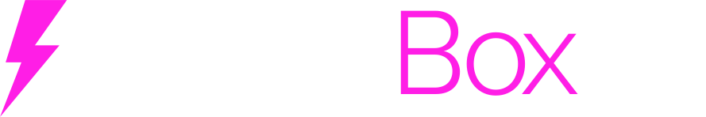
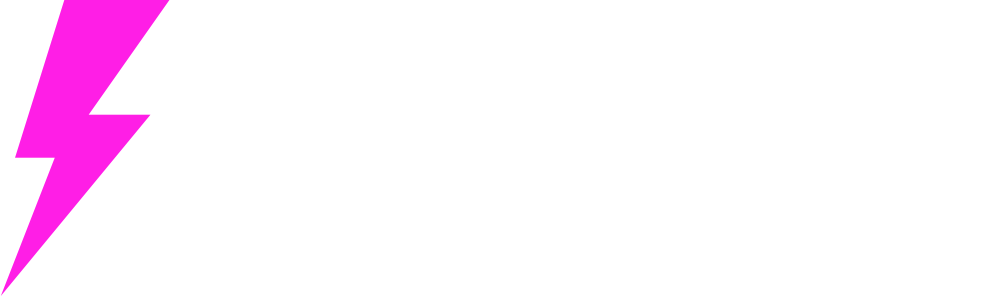

<!-- _class: center-slide -->

---

## What Is LNbitsBox?

**LNbitsBox is a self-hosted Lightning appliance.**

A Linux appliance that boots into a working LNbits server, with the critical parts already wired together.

- First-run setup wizard
- LNbits with Phoenixd, Ark(ade) or Spark Lightning funding sources
- Tor hidden service
- Clearnet URL
- Admin control panel
- Wi-Fi config
- OTA updates
- Manual and rolling encrypted backup and recovery
- Local HTTPS with installable CA

---

## Why?

**Because sovereign self-hosting can be easy.**

LNbitsBox gives you a fully self-contained Lightning appliance that is easy to set up, use, and maintain.

  

    <h3>Personal node</h3>
    
Run your own LNbits instance at home with no cloud account required for the core experience.

  

  

    <h3>Workshop device</h3>
    
Use it in a classroom, hackerspace, event booth, or hands-on Bitcoin workshop.

  

  

    <h3>Merchant / project box</h3>
    
Prototype payments, private reachability, tunnels, updates, and recovery flows in the real world.

  

- Tor support for private reachability
- Admin panel for status, services, Wi-Fi, updates, and tunnels
- Built for demos: reset, reconfigure, update, recover

---

## Why NixOS?

**Because hardware for money should be reproducible**

NixOS makes the whole appliance declarative: services, ports, files, packages and update flow.

- Same config builds the same system image
- Easier OTA updates
- Rollback-friendly when updates go wrong
- Services are explicit: LNbits, funding sources, Caddy, Tor, admin app
- Great fit for appliances: define the state and ship it

---

<!-- _class: center-slide -->
# Demo

---

<!-- _class: center-slide -->

# LNbitsBox.com
